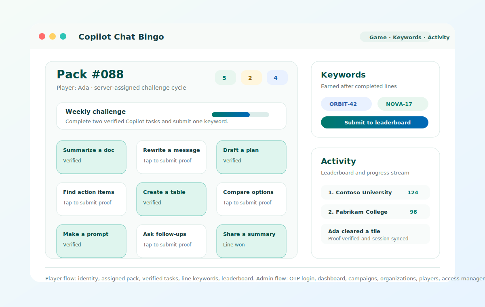
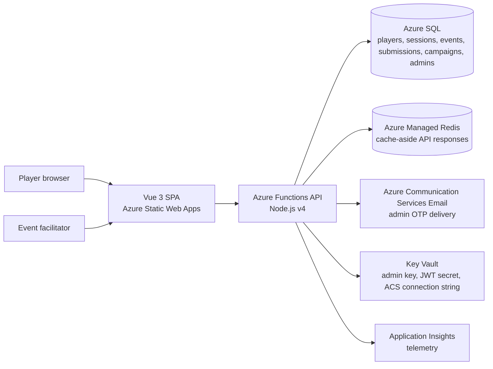
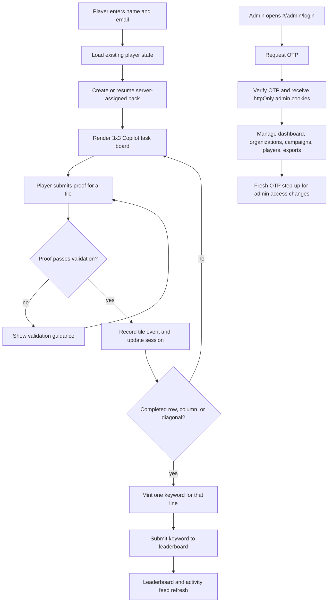

# Copilot Chat Bingo

A browser-based Bingo game for Microsoft 365 Copilot Chat events. Players receive a server-assigned deterministic 3×3 board, complete Copilot tasks, submit proofs, earn keywords for each completed line, and submit those keywords to a shared leaderboard. Event facilitators can manage campaigns, players, organizations, exports, and admin access from an OTP-protected admin portal.



## Open source and support

This repository is shared as an open-source sample for organizations and facilitators running Microsoft 365 Copilot adoption events. It is not an official Microsoft support channel unless maintainers state otherwise.

- Contributions: see [CONTRIBUTING.md](CONTRIBUTING.md).
- Community expectations: see [CODE_OF_CONDUCT.md](CODE_OF_CONDUCT.md).
- Security vulnerabilities: do not open public issues; follow [SECURITY.md](SECURITY.md).
- Support boundaries and help: see [SUPPORT.md](SUPPORT.md).
- Azure deployment: start with [DEPLOYMENT.md](DEPLOYMENT.md), or use the repeatable Terraform path in [infra/terraform/README.md](infra/terraform/README.md).
- License and trademark notes: see [License and trademarks](#license-and-trademarks).

## What it does

Copilot Chat Bingo turns event participation into a lightweight challenge loop: players receive a server-assigned pack, complete Copilot Chat tasks, submit proof for each tile, earn line keywords, and submit those keywords to a shared leaderboard. Facilitators use the admin portal to manage campaigns, organizations, players, exports, and admin access.

## Features

- **Deterministic assigned boards** — pack numbers `1`–`999` always generate the same nine tasks, while the API assigns and rotates packs fairly per player.
- **Proof submission & verification** — per-tile validation rules check the player's submitted proof before clearing the tile.
- **Line detection & keyword minting** — completing a row, column, or diagonal awards a unique keyword, exactly once per line.
- **Weekly challenges** — bonus progression tracked alongside the main board.
- **Shared leaderboard** — keyword submissions are stored in Azure SQL and ranked per-organization across all players.
- **OTP-protected admin portal** — Azure Communication Services Email sends admin one-time codes for portal login.
- **Cookie-based admin sessions** — admin access, refresh, and step-up JWTs are delivered in httpOnly cookies rather than browser-accessible storage.
- **Admin operations** — event facilitators can view engagement metrics, export CSV data, manage organizations, manage campaigns, inspect players, and perform safety actions.
- **Admin access management** — bootstrap admins come from `ADMIN_EMAILS`; portal-managed admins are stored in Azure SQL and require a fresh OTP step-up before add/remove changes.
- **Session continuity** — reloading the page restores the active board, cleared tiles, earned keywords, and challenge progress from `localStorage`.
- **Responsive UI** — Tailwind CSS v4 layout that remains usable on narrow viewports.

## Architecture



| Layer               | Responsibility                                                                                                                        |
| ------------------- | ------------------------------------------------------------------------------------------------------------------------------------- |
| Vue SPA             | Player onboarding, board play, keyword submission, activity view, and admin portal screens.                                           |
| Azure Functions API | HTTP endpoints for sessions, tile events, submissions, leaderboard, campaign config, admin auth, and admin operations.                |
| Azure SQL           | Durable storage for game state, progression scoring, organization mappings, campaign settings, OTP hashes, and portal-managed admins. |
| Azure Managed Redis | Optional cache-aside layer for active campaign config, organization domains, and leaderboard responses.                               |
| ACS Email           | Production delivery for admin OTP login and sensitive admin-management step-up verification.                                          |
| Key Vault           | Holds generated app secrets referenced by Function App settings.                                                                      |
| Terraform           | Provisions Azure infrastructure; local state, tfvars, and plans are intentionally ignored.                                            |

## App flow



## Get started

### Prerequisites

- Node.js 20.x or later and npm 10.x
- Docker Desktop, if you want the fastest full-stack local run
- Azure Functions Core Tools v4, if you want to run the backend directly with `npm start`
- Azure CLI and Terraform only when provisioning or deploying Azure infrastructure

### Option 1: run the full stack with Docker Compose

This starts Azure SQL Edge, runs database migrations, starts the backend API, and serves the built frontend.

```bash
git clone https://github.com/<your-org-or-user>/m365copilot-game.git
cd m365copilot-game
docker compose up --build
```

Open [http://localhost:8080](http://localhost:8080). The local compose file uses development-only credentials and the bootstrap admin email `admin@test.com`.

### Option 2: run the dev servers manually

Use this path when you want frontend hot reload and local backend debugging.

```bash
git clone https://github.com/<your-org-or-user>/m365copilot-game.git
cd m365copilot-game

# Start the local database and apply migrations.
docker compose up db db-init
```

Create `backend/local.settings.json` with local-only values:

```json
{
  "IsEncrypted": false,
  "Values": {
    "AzureWebJobsStorage": "UseDevelopmentStorage=true",
    "FUNCTIONS_WORKER_RUNTIME": "node",
    "SQL_CONNECTION_STRING": "Server=tcp:localhost,1433;Initial Catalog=bingo_db;User ID=sa;Password=<local-sa-password>;Encrypt=false;TrustServerCertificate=true;",
    "ADMIN_KEY": "<local-admin-key>",
    "JWT_SECRET": "<local-jwt-secret-at-least-32-characters>",
    "ADMIN_EMAILS": "admin@test.com",
    "REDIS_CONNECTION_STRING": "redis://localhost:6379",
    "ALLOWED_ORIGINS": "http://localhost:5173,http://localhost:8080",
    "ADMIN_COOKIE_SECURE": "false",
    "ADMIN_COOKIE_SAMESITE": "Lax",
    "NODE_ENV": "development"
  }
}
```

If you use the root Docker Compose database for manual development, set `<local-sa-password>` to the local-only SQL password defined in [docker-compose.yml](docker-compose.yml). Do not reuse local development values in shared, staging, or production environments.

Redis is optional for local development. Start the Compose `redis` service or any local Redis on port `6379` to exercise the cache path; omit `REDIS_CONNECTION_STRING` and the backend will fall back to Azure SQL reads.

Then start the API and frontend in separate terminals:

```bash
cd backend
npm ci
npm start
```

```bash
cd frontend
npm ci
npm run dev
```

Open [http://localhost:5173](http://localhost:5173). The Vite dev server proxies `/api` to the local Functions host.

### Verify changes

Use clean installs so local verification matches CI and deployment builds:

```bash
cd backend
npm ci
npm run typecheck
npm run build
npm run lint
npm run format:check
npm test

cd ../frontend
npm ci
npm run typecheck
npm run lint
npm run format:check
npm test
```

For browser smoke coverage, run the Playwright suite from the frontend project. The suite starts Vite automatically and mocks API responses for deterministic player and admin flows:

```bash
cd frontend
npm run e2e
```

For a full-stack manual browser pass, run the root Docker Compose stack and exercise the same player/admin flows against the local backend and database.

### Security notes for contributors

Never commit local secrets or generated deployment files. The repository ignores `.env*`, `backend/local.settings*.json`, Terraform state and tfvars, Terraform plans, Azure publish profiles, SWA artifacts, local key/certificate material, and test reports. Use placeholder values in public examples and put real production secrets in Azure App Settings or Key Vault.

## Project layout

| Path                           | Description                                                                           |
| ------------------------------ | ------------------------------------------------------------------------------------- |
| [frontend/](frontend/)         | Vue 3 + Tailwind CSS v4 single-page application.                                      |
| [backend/](backend/)           | Azure Functions v4 (Node.js) API — sessions, events, submissions, leaderboard, admin. |
| [database/](database/)         | Azure SQL migration scripts (schema + seed data).                                     |
| [scripts/](scripts/)           | Local Docker Compose database bootstrap scripts.                                      |
| [index.html](index.html)       | Legacy single-file build, kept as a rollback target.                                  |
| [openspec/](openspec/)         | Spec-driven change history.                                                           |
| [DEPLOYMENT.md](DEPLOYMENT.md) | **Step-by-step Azure deployment guide.**                                              |

### Frontend source

| Path                                                   | Description                                                                                                  |
| ------------------------------------------------------ | ------------------------------------------------------------------------------------------------------------ |
| [frontend/src/App.vue](frontend/src/App.vue)           | Root shell with tabs for Game, Keys, Activity, and Help, plus hash-routed admin views.                       |
| [frontend/src/components/](frontend/src/components/)   | UI components (board, panels, modals, HUD).                                                                  |
| [frontend/src/composables/](frontend/src/composables/) | Reactive game state, submissions, and toast helpers.                                                         |
| [frontend/src/lib/](frontend/src/lib/)                 | Pure logic: deterministic RNG, pack generation, verification, keyword minting, API client, storage adapters. |
| [frontend/src/data/](frontend/src/data/)               | Static data: task bank, line definitions, organization map, storage key constants.                           |

### Backend source

| Path                                             | Description                                                                         |
| ------------------------------------------------ | ----------------------------------------------------------------------------------- |
| [backend/src/functions/](backend/src/functions/) | HTTP-triggered Azure Functions (one file per endpoint).                             |
| [backend/src/lib/](backend/src/lib/)             | Shared helpers — SQL connection pool, input validation, admin auth, email delivery. |
| [backend/host.json](backend/host.json)           | Azure Functions host configuration (route prefix, logging).                         |

## Deploy to Azure

See [DEPLOYMENT.md](DEPLOYMENT.md) for a complete step-by-step guide covering the manual Azure CLI path. For repeatable deployments with managed identities, Key Vault references, and Terraform-managed infrastructure, use [infra/terraform/README.md](infra/terraform/README.md).

1. Creating an Azure SQL Database and running migrations
2. Deploying the Azure Functions API
3. Deploying the frontend to Azure Static Web Apps
4. Configuring CORS, environment variables, and custom domains
5. Post-deploy verification and troubleshooting

## API endpoints

| Method   | Route                            | Purpose                                                   |
| -------- | -------------------------------- | --------------------------------------------------------- |
| `POST`   | `/api/sessions`                  | Create player + game session                              |
| `PATCH`  | `/api/sessions/{id}`             | Update session progress                                   |
| `POST`   | `/api/events`                    | Record tile events                                        |
| `POST`   | `/api/submissions`               | Submit keyword for leaderboard                            |
| `GET`    | `/api/leaderboard`               | Aggregated org rankings                                   |
| `GET`    | `/api/player/state`              | Restore player state by email                             |
| `GET`    | `/api/campaigns/active`          | Active campaign configuration                             |
| `GET`    | `/api/organizations/domains`     | Organization domain mappings                              |
| `POST`   | `/api/portal-api/request-otp`    | Send admin login or step-up OTP                           |
| `POST`   | `/api/portal-api/verify-otp`     | Verify admin OTP and issue a session or step-up token     |
| `GET`    | `/api/portal-api/dashboard`      | Admin metrics, using admin JWT or `X-Admin-Key`           |
| `GET`    | `/api/portal-api/export`         | CSV export, using admin JWT or `X-Admin-Key`              |
| `GET`    | `/api/portal-api/admins`         | List bootstrap and portal-managed admins                  |
| `POST`   | `/api/portal-api/admins`         | Add/reactivate portal-managed admin; requires step-up OTP |
| `DELETE` | `/api/portal-api/admins/{email}` | Disable portal-managed admin; requires step-up OTP        |

The admin portal is available at `#/admin/login` in the frontend. Login uses the email allow-list from `ADMIN_EMAILS` plus active rows in `admin_users`. In production, OTP delivery requires `ACS_CONNECTION_STRING` and `ACS_EMAIL_SENDER`; if delivery fails after an OTP is stored, that OTP is invalidated before the API returns an error.

## Data & persistence

- **Server-side**: game sessions, tile events, keyword submissions, campaign/admin metadata, and portal-managed admin users are stored in Azure SQL. The leaderboard is shared across all players.
- **Client-side**: active board state (cleared tiles, earned keywords, challenge progress) and player profile are stored in the browser's `localStorage`.

## Data handling and privacy

Deployers are responsible for the privacy, consent, retention, access control, and compliance obligations for their event or organization. A production deployment can store or process:

- Player names and email addresses collected during onboarding
- Gameplay progress, tile events, earned keywords, leaderboard scores, and campaign participation records
- Admin email addresses, admin access records, and OTP metadata
- CSV exports that can include player names, email addresses, organization mappings, and score activity
- Function App, browser, database, and deployment logs that may contain operational identifiers

Protect exported CSV files, logs, Terraform state, local settings, app settings, and deployment credentials according to your organization's data-handling policies. Do not commit production secrets or attendee data to the repository.

## Specs & change history

This repository uses OpenSpec for spec-driven development.

- Current spec: [openspec/specs/bingo-frontend/spec.md](openspec/specs/bingo-frontend/spec.md)
- Archived changes: [openspec/changes/archive/](openspec/changes/archive/)

When proposing a behavior change, add a new entry under `openspec/changes/` with a proposal, design, tasks, and a delta spec. After implementation, archive the change and sync the main spec.

## License and trademarks

This project is licensed under the MIT license. See [LICENSE](LICENSE).

Release review: before publishing the repository publicly, maintainers should confirm whether the copyright holder in [LICENSE](LICENSE) should remain `Microsoft Singapore` or use another Microsoft legal entity.

Microsoft, Microsoft 365, and Copilot are trademarks or registered trademarks of Microsoft Corporation in the United States and other countries. Use of those names in this repository is for descriptive purposes and does not grant trademark rights or imply product support beyond the terms stated in this repository. The software is provided as-is under the license terms.
