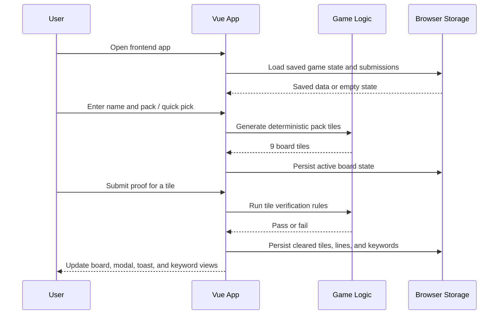

## Context

The current Bingo game is implemented as a single root `index.html` file that combines markup, styling, seeded task generation, verification logic, local storage persistence, modal flows, and client-side leaderboard behavior. The change introduces a dedicated `frontend/` application so the game can be maintained as a modular Vue 3 app while preserving the current browser-only runtime model.

Key constraints:
- The existing gameplay behavior must remain functionally equivalent during the migration.
- The frontend must live under `frontend/`.
- Tailwind CSS must be the primary global styling entry point via `tailwind.css`.
- The app remains client-side only for this change; no new backend services are introduced.

Stakeholders:
- Frontend maintainers who will extend the game UI.
- Content maintainers who update task bank prompts and verification rules.
- Event owners who rely on the existing browser-based game flow.

## Goals / Non-Goals

**Goals:**
- Move the Bingo game into a dedicated Vue 3 frontend application in `frontend/`.
- Preserve current user-facing behavior for setup, board play, verification, keyword claiming, challenge progress, submissions, and leaderboard rendering.
- Replace inline page styling with Tailwind CSS, using `tailwind.css` as the global entry point for theme tokens, utilities, and shared effects.
- Separate game logic from rendering so deterministic board generation, verification, and persistence can be tested independently from UI components.
- Allow a staged rollout where the existing static page can remain as a rollback target until the Vue frontend reaches parity.

**Non-Goals:**
- Adding server-side validation, authentication, or backend storage.
- Redesigning game rules, prompts, keyword formats, or leaderboard semantics.
- Hardening prototype security beyond preserving the current browser-only behavior.
- Replacing the current visual identity with a new design system.

## Decisions

### 1. Create a Vite-based Vue 3 single-page frontend in `frontend/`

The new frontend will be a self-contained Vue 3 application under `frontend/`, with a single application shell that renders the existing tabs and modal flows.

Rationale:
- Keeps build tooling and source files isolated from repo-level OpenSpec artifacts.
- Matches the requested folder structure directly.
- Minimizes migration friction by supporting a straightforward SPA port of the current browser-only app.

Alternatives considered:
- Keep a single static HTML file and add Vue from a CDN. Rejected because it preserves the current maintenance problem and does not meaningfully separate concerns.
- Use a heavier framework such as Nuxt. Rejected because the app is fully client-side and does not need SSR or routing complexity.

### 2. Split logic into pure modules and Vue composables instead of porting DOM code directly

Existing logic for seeded pack generation, keyword minting, verification rules, persistence, and leaderboard calculation will be moved into plain modules and composables. Components will consume reactive state rather than calling `document.getElementById`, mutating `innerHTML`, or registering inline `onclick` handlers.

Rationale:
- Preserves behavior while making the migration testable.
- Avoids a brittle hybrid where Vue renders some content but imperative DOM code still owns state changes.
- Keeps business rules reusable across components.

Alternatives considered:
- Port all existing functions into a single `App.vue`. Rejected because it would recreate the current coupling in a different file format.
- Introduce a dedicated store library immediately. Rejected because the state surface is moderate and can be handled with composables first.

### 3. Use `tailwind.css` as the single global style entry and keep design tokens there

Tailwind CSS will be the primary styling system. The app bootstrap will import `tailwind.css` once, and components will use utility classes for structure, spacing, typography, and responsive behavior. Shared colors, gradients, animations, and reusable visual tokens will live in the Tailwind layer rather than in a large legacy stylesheet.

Rationale:
- Satisfies the explicit requirement to use Tailwind CSS.
- Keeps component markup expressive without forcing every complex visual rule into long inline class strings.
- Preserves the current visual personality while moving to a maintainable styling model.

Alternatives considered:
- Keep a large standalone CSS file and add Tailwind only for utilities. Rejected because Tailwind would become incidental rather than authoritative.
- Translate every visual rule into utility classes only. Rejected because some gradients, overlays, and animation details are clearer as shared Tailwind-layer definitions.

### 4. Preserve deterministic and persisted behavior during migration

The frontend will preserve the current deterministic pack generation, verification rules, keyword generation shape, and browser storage behavior unless implementation work discovers a compatibility issue that must be explicitly documented.

Rationale:
- Users expect identical gameplay from the same pack inputs.
- Reduces migration risk by keeping behavior parity as the baseline.
- Avoids unnecessary resets of in-progress boards and submissions.

Alternatives considered:
- Reset storage and start fresh with a new state schema. Rejected because it changes behavior without product value.
- Simplify verification or keyword generation during migration. Rejected because it would silently alter the game contract.

### 5. Keep the legacy page available until parity is verified

The root static page should remain available during migration and early verification, allowing a controlled switch to the frontend build after the Vue implementation is validated.

Rationale:
- Provides a rollback path with low operational risk.
- Allows side-by-side comparison against the current implementation.

Alternatives considered:
- Replace the root page immediately. Rejected because there is no safety net if migration bugs are found late.

### Sequence Diagram: Game Session Flow

## Risks / Trade-offs

- [Behavior drift during refactor] → Mitigation: keep pure logic outputs aligned with the current implementation and validate key flows against the existing page.
- [Styling regression during Tailwind migration] → Mitigation: move theme tokens into `tailwind.css` first and preserve the current layout and responsive behavior before any redesign.
- [Storage compatibility issues] → Mitigation: preserve existing local storage key names and value shapes unless a migration step is explicitly added.
- [Over-coupling component state] → Mitigation: isolate reusable game and submission logic in composables or plain modules rather than letting components own business rules.
- [Prototype security limitations remain visible] → Mitigation: preserve current warning text and avoid implying new server-side guarantees in this change.

## Migration Plan

1. Scaffold the Vue frontend under `frontend/` with Tailwind configured through `tailwind.css`.
2. Extract constants, task bank data, verification helpers, seeded generation, keyword minting, and storage access into modules.
3. Build the main application shell and tab panels in Vue.
4. Port interactive flows for setup, board rendering, tile verification, win modal, toast notifications, keyword list, submission form, and leaderboard.
5. Validate parity for deterministic board generation, proof verification, keyword generation, weekly progress, and browser persistence.
6. Switch the primary served experience to the frontend build only after parity checks pass.

Rollback strategy:
- If the migrated frontend fails parity validation, keep serving or revert to the existing root static page while defects are fixed.

## Open Questions

- Should the root `index.html` eventually redirect to the built frontend, or should the built frontend replace it directly during deployment?
- Must local storage keys remain byte-for-byte identical, or is a one-time migration acceptable if behavior is preserved?
- Is there any expected package manager or frontend tooling preference beyond Vue and Tailwind for this repo?