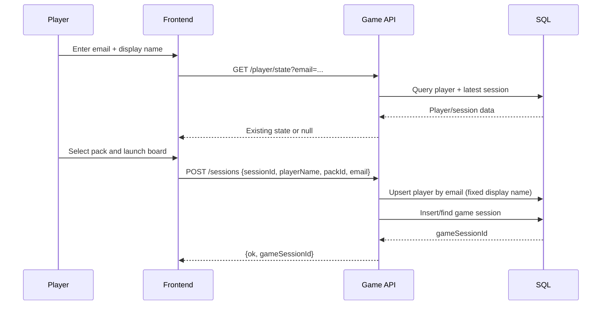
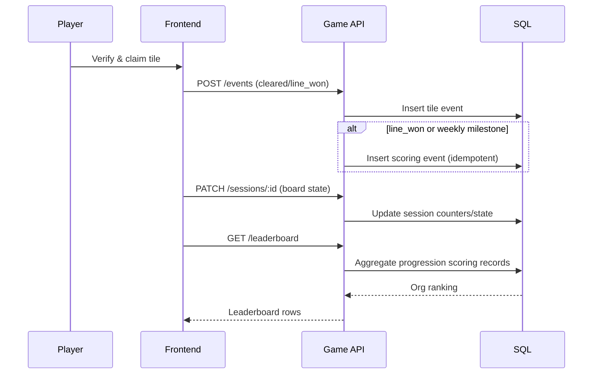

## Context

The current game flow captures email up front, but still requires manual keyword submission with repeated identity fields for leaderboard scoring. This creates conflicting mental models: progress is persisted automatically, yet scoring requires explicit post-game form entry. Product direction is now clear:

- Leaderboard score MUST represent verified gameplay progression.
- Display name MUST be fixed at onboarding.
- Submit tab should be replaced by a read-only My Activity view.

This change crosses frontend navigation/state, API scoring behavior, and database aggregation model, and affects admin reporting.

## Goals / Non-Goals

**Goals:**
- Make verified gameplay events the only scoring source for leaderboard ranking.
- Capture identity once at onboarding (email + display name) and treat display name as immutable in normal player UX.
- Replace manual Submit flow with read-only My Activity timeline showing earned progression and score contributions.
- Preserve offline-resilient gameplay and cross-device resume behavior.
- Keep a controlled rollback path during rollout.

**Non-Goals:**
- Redesigning game rules, tile verification logic, or pack generation.
- Introducing account/password auth for players.
- Reworking admin authentication model.
- Building a full profile management feature.

## Decisions

1. Scoring source of truth will move from manual submissions to progression-scoring records.
- Decision: Persist score-bearing events from verified progression (line wins + weekly progression milestones) into a dedicated scoring record model and aggregate leaderboard from those records.
- Rationale: Aligns scoreboard with actual gameplay verification, eliminates repeated user data entry, and reduces invalid/manual entry risk.
- Alternative considered: Keep manual submission but prefill fields. Rejected because it retains a dual source of truth and user confusion.

2. Onboarding identity will collect immutable display name.
- Decision: Email gate becomes onboarding identity gate with required email + display name. Display name is persisted and treated as fixed for gameplay and scoring attribution.
- Rationale: Matches product intent and removes name prompts from board setup and submission surfaces.
- Alternative considered: Allow profile edits later. Rejected for now to avoid identity drift and scoring attribution ambiguity.

3. Setup panel will become pack-selection-only.
- Decision: Remove setup name field; keep deterministic pack selection/quick pick and launch actions.
- Rationale: Name no longer belongs in setup because identity is established before gameplay.
- Alternative considered: Keep optional alias in setup. Rejected to avoid duplicate identity concepts.

4. Submit tab will be replaced with My Activity read-only timeline.
- Decision: Navigation/tab and corresponding panel become read-only activity history sourced from server + local fallback cache, showing scoring-impacting events and timestamps.
- Rationale: Preserves transparency while removing manual submission behavior.
- Alternative considered: Keep Submit as fallback. Rejected for primary UX; retained only as temporary rollback mechanism via feature flag.

5. Manual submission endpoint will be deprecated for player flow.
- Decision: `POST /api/submissions` remains temporarily available behind rollback controls, but frontend player flow no longer uses it for scoring.
- Rationale: Enables safe staged rollout and emergency backout without data loss.
- Alternative considered: Hard delete endpoint immediately. Rejected to reduce rollout risk.

6. Admin/reporting will pivot to progression-based scoring views.
- Decision: Admin dashboard and CSV exports will read from progression scoring records (or compatible unified view) instead of submission-only data.
- Rationale: Admin metrics must stay consistent with leaderboard source of truth.

### Sequence diagram: Onboarding and board launch

### Sequence diagram: Verified progression to leaderboard

## Risks / Trade-offs

- [Risk] Scoring regressions during source-of-truth switch (submission -> progression) -> Mitigation: dual-write period + leaderboard parity checks in staging and production shadow metrics.
- [Risk] Duplicate score awards from repeated event sends -> Mitigation: idempotency key/unique constraint per scoring event type + line/week identity.
- [Risk] Legacy clients still calling submit flow -> Mitigation: feature flag and backward-compatible endpoint behavior until clients are upgraded.
- [Risk] Player confusion if activity feed lags leaderboard -> Mitigation: same write path for scoring and activity, plus immediate optimistic UI entry with reconciliation.
- [Trade-off] Immutable display name improves consistency but reduces flexibility -> Mitigation: allow admin-side correction path for support cases.

## Migration Plan

1. Add DB migration for progression scoring records and indexes needed for leaderboard aggregation.
2. Implement backend scoring write path from verified progression events with idempotent safeguards.
3. Update leaderboard query to progression-based source; keep old query behind feature flag.
4. Update frontend onboarding (email + fixed display name), setup (pack only), and tab replacement (My Activity).
5. Keep `POST /submissions` endpoint operational but remove it from player UX.
6. Backfill or reconcile any in-flight campaign data if needed (optional one-time script).
7. Rollout behind feature flag by environment/campaign.
8. Validate parity and then disable submission-based scoring path.

Rollback strategy:
- Re-enable submission-based leaderboard aggregation via feature flag.
- Restore Submit tab in frontend if necessary.
- Keep progression events data; no destructive rollback required.

## Open Questions

- Should My Activity show tile-cleared events or only score-bearing events (line/week)?
- Do we need campaign-level toggles for immutable display name enforcement during transition?
- Should deprecated submission endpoint return 410 for player traffic after rollout, or remain admin-only internal?
- Is historical leaderboard data recalculation required for already-running campaigns?
