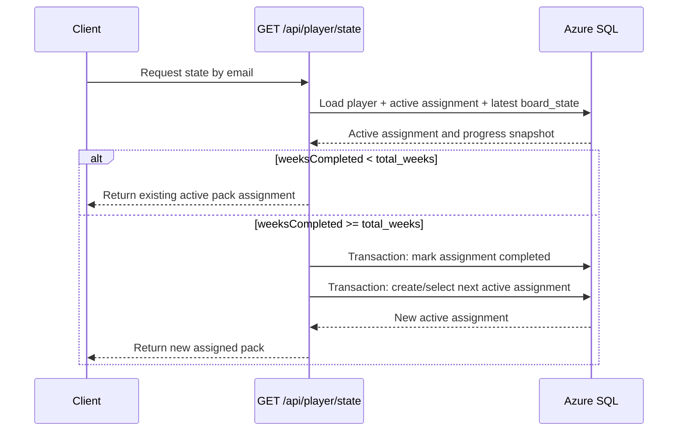
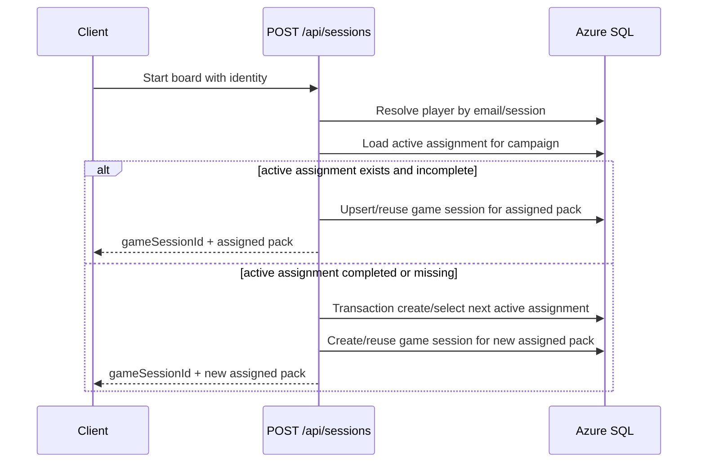

## Context

Players currently choose packs manually at setup, with optional quick-pick generated client-side. This enables pack shopping, creates inconsistent behavior across devices, and leaves pack identity partially controlled by local browser state. The current stack already stores challenge progress (`challengeProfile`) server-side in `game_sessions.board_state`, and completion semantics are defined as `weeksCompleted` reaching campaign `total_weeks` (currently 7).

This change crosses frontend, backend API, and database concerns. It introduces a server-authoritative pack lifecycle: assign once per active cycle, keep stable while incomplete, and rotate to a new pack after the cycle is completed.

Stakeholders: game product owner, frontend team, backend/API team, QA.
Constraints: preserve cross-device resume behavior, avoid duplicate active assignments during concurrent logins, and keep rollback feasible.

## Goals / Non-Goals

**Goals:**
- Enforce exactly one active pack assignment per player per campaign.
- Keep assignment stable while `weeksCompleted < total_weeks`.
- Rotate to a new pack on next login/session bootstrap after completion (`weeksCompleted >= total_weeks`).
- Make assignment server-authoritative and deterministic under concurrent requests.
- Preserve historical completed cycles for analytics and troubleshooting.

**Non-Goals:**
- Redesigning tile verification or keyword minting rules.
- Changing campaign scoring semantics.
- Implementing anti-repeat pack strategy across all historical cycles (deferred policy decision).

## Decisions

### Decision 1: Introduce explicit assignment lifecycle persistence
Adopt a dedicated assignment lifecycle record per player+campaign cycle (active/completed) rather than relying on implicit `game_sessions` uniqueness by `player_id, pack_id, campaign_id`.

Rationale:
- Supports "same pack until completion, then rotate" cleanly.
- Enables preserving completed cycles while enforcing one active cycle.
- Avoids overloading `game_sessions` uniqueness semantics.

Alternatives considered:
- Reuse only `game_sessions` with changed unique keys: simpler migration but weaker lifecycle clarity and harder historical analysis.
- Client-only memory lock: rejected due to cross-device inconsistency and fairness issues.

### Decision 2: Rotation trigger is completion observed at login bootstrap
Treat completion as `weeksCompleted >= total_weeks` from persisted board state. On login bootstrap (`GET /player/state` path) and/or session bootstrap (`POST /sessions` path), if active assignment is complete, atomically mark it completed and create/select next active assignment.

Rationale:
- Matches user expectation: "next login gets new pack".
- Reuses existing persisted challenge profile source of truth.
- Avoids forcing users to click explicit "next pack" actions.

Alternatives considered:
- Rotate immediately when week 7 is earned: possible race with in-flight updates and less transparent UX.
- Rotate only on admin batch jobs: delayed and confusing for players.

### Decision 3: Frontend setup becomes assignment display, not assignment selection
Remove manual pack input and quick-pick from player setup. Setup displays assigned pack and cycle status (active vs completed-ready-for-next).

Rationale:
- Prevents pack shopping at UX layer.
- Aligns client behavior with server authority.
- Reduces onboarding friction.

Alternatives considered:
- Keep pack picker but ignore client value server-side: functional but confusing and prone to trust issues.

### Decision 4: Concurrency-safe assignment creation
Use transactional/constraint-backed write path to guarantee one active assignment per player+campaign.

Rationale:
- Two simultaneous logins must converge on the same active assignment.
- Prevents duplicate active rows and inconsistent pack IDs across devices.

Alternatives considered:
- Best-effort app-level locking: insufficient under scale-out function instances.

### Sequence Diagram: Login bootstrap with completion-based rotation

### Sequence Diagram: Session bootstrap with assignment lock

## Risks / Trade-offs

- [Risk] Rotation decision depends on board_state integrity. -> Mitigation: validate/normalize challengeProfile on write and fallback to conservative non-rotation when state malformed.
- [Risk] Concurrent login races could create duplicate active assignments. -> Mitigation: enforce DB uniqueness for active assignment and transactional upsert.
- [Risk] Existing users with manually selected packs may have ambiguous migration state. -> Mitigation: migration rule seeds first active assignment from most recent session per player/campaign.
- [Risk] UX confusion after week-7 completion if pack changes silently on next login. -> Mitigation: add explicit UI message indicating previous cycle completed and new pack assigned.
- [Trade-off] Dedicated assignment lifecycle table/fields adds schema complexity. -> Benefit: clear semantics, auditable history, and safer concurrency behavior.

## Migration Plan

1. Add assignment lifecycle schema changes and indexes (backward-compatible).
2. Backfill active assignments from existing latest game session per player/campaign.
3. Update API contract to return assigned pack metadata from state/session endpoints.
4. Update frontend setup to render assigned-pack flow and remove user pack choice.
5. Deploy behind feature flag for phased rollout.
6. Validate with synthetic concurrent login tests and cross-device resume tests.

Rollback strategy:
- Disable flag to restore legacy manual pack setup paths.
- Keep new schema in place but stop reading/writing assignment lifecycle records.
- Continue operating on existing game_sessions behavior while investigating.

## Open Questions

- Should next-pack generation avoid historical repeats for a player across all prior cycles?
- Should rotation occur only on explicit "Continue" click after login, or immediately at state bootstrap?
- Should completed-cycle summary be shown before launching the new pack automatically?
