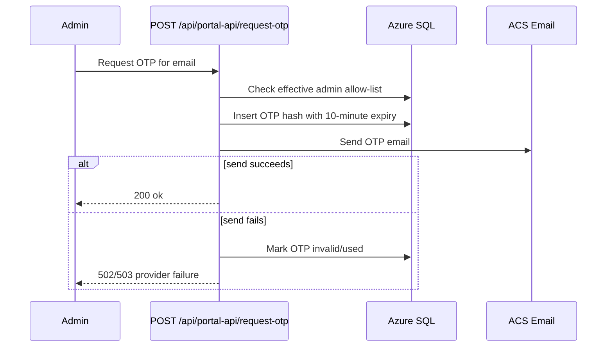
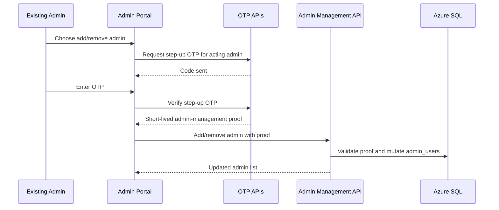

## Context

Admin login is already specified as email + OTP with JWT sessions, and OTP records already include `expires_at` and `used` fields. The runtime gap is email delivery: `requestOtp` generates and stores a code but does not send it through Azure Communication Services Email yet. Admin emails are also sourced only from `ADMIN_EMAILS`, which is suitable for bootstrap access but not portal-managed admin onboarding.

This change tightens the admin authentication surface in two places: reliable OTP delivery and safer admin allow-list mutation.

## Goals / Non-Goals

**Goals:**
- Send admin OTP messages through Azure Communication Services Email in production.
- Keep OTP expiry at 10 minutes and preserve single-use verification semantics.
- Invalidate OTP records when email delivery fails after insertion.
- Return an explicit provider outage/failure response for allow-listed admins when ACS Email cannot send the code.
- Add portal-managed admin emails backed by database persistence.
- Require a fresh OTP re-verification before adding or removing admin emails.
- Keep `ADMIN_EMAILS` and `x-admin-key` available as bootstrap/break-glass controls.

**Non-Goals:**
- Replacing OTP with Microsoft Entra authentication.
- Adding role tiers beyond admin access.
- Sending OTPs to regular players.
- Removing the legacy static admin key fallback in this change.

## Decisions

### Decision 1: Use ACS Email as the production OTP delivery provider

Add a small email provider helper around the Azure Communication Services Email SDK. The helper should read configured connection details and sender address from Function App settings, send a short admin verification email, and return structured success/failure information without logging OTP values in production.

Rationale: keeps provider code out of the request handler, makes tests straightforward, and aligns the runtime behavior with deployment expectations.

### Decision 2: Explicit failure for allow-listed admins on provider outage

When an email belongs to the admin allow-list but ACS Email cannot send the OTP, return a `502` or `503` response with a generic message such as `Could not send verification code. Please try again later.`

Rationale: returning success would move real admins to the OTP entry step even though no code can arrive. Non-admin requests should still return generic success and should not store or send OTPs.

### Decision 3: Invalidate failed-send OTP rows

The request flow may insert the OTP before calling ACS Email. If the send fails, the stored OTP must be made unusable before returning the provider failure. The minimal implementation can set `used = 1`; a richer schema can add delivery status fields later if audit detail is needed.

Rationale: a code that was not delivered should never become valid later because of retries, delayed provider behavior, or manual log inspection.

### Decision 4: Database-backed admin allow-list with environment bootstrap

Introduce an `admin_users` table for portal-managed admin emails. Effective admin eligibility is the union of active `admin_users` rows and normalized emails from `ADMIN_EMAILS`.

Rationale: admins need to add/remove other admins without redeploying app settings, while `ADMIN_EMAILS` remains a reliable break-glass path if database admin records are misconfigured.

### Decision 5: Step-up OTP before admin add/remove

Adding or removing admin emails requires the acting admin to complete a fresh OTP challenge immediately before the change. The step-up proof should be short-lived and scoped to admin-management actions, not a general session refresh.

Rationale: admin allow-list changes are more sensitive than normal dashboard reads. A stolen or unattended session should not be enough to add a new admin or remove an existing one.

### Sequence Diagram: OTP request with ACS failure invalidation

### Sequence Diagram: Step-up OTP for admin allow-list change

## Risks / Trade-offs

- **Provider outage blocks portal login:** Admins cannot receive OTP during ACS Email failures. Mitigation: keep `x-admin-key` for break-glass API access and return a clear provider failure for allow-listed admins.
- **Step-up OTP adds friction:** Admin add/remove takes an extra email round trip. This is acceptable because the action is rare and high impact.
- **Environment and database allow-lists may diverge:** An email in `ADMIN_EMAILS` remains admin even if not listed in the portal. Mitigation: label these as bootstrap admins in UI and document that removal requires app setting changes.
- **Using `used = 1` for send failure loses reason detail:** Minimal schema avoids extra complexity. If operational auditing needs grow, add status/reason columns in a later change.

## Migration Plan

1. Add `admin_users` persistence and seed or expose bootstrap admins from `ADMIN_EMAILS` as read-only effective admins.
2. Add ACS Email configuration settings and provider helper.
3. Update OTP request flow to send via ACS, invalidate failed-send OTPs, and return explicit provider failures for allow-listed admins.
4. Add step-up OTP proof generation/verification for admin-management operations.
5. Add backend endpoints and frontend UI for admin email listing, add, and remove/disable.
6. Update deployment docs and tests.

## Open Questions

- Should admin removal be a soft disable only, or should physical deletion be allowed for never-used records?
- How long should a step-up OTP proof remain valid? Initial recommendation: 5 minutes.
- Should adding/removing admins also require typing the target email as a confirmation phrase?