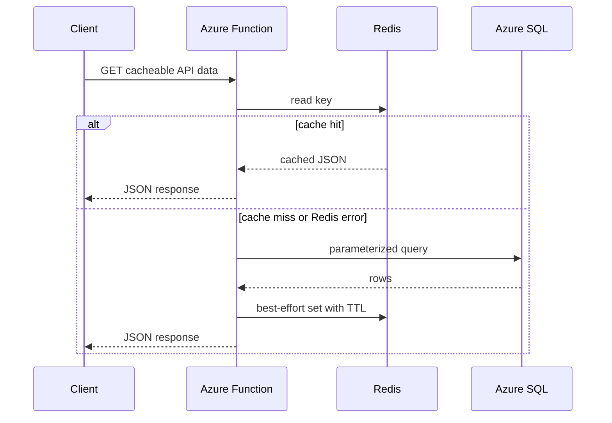
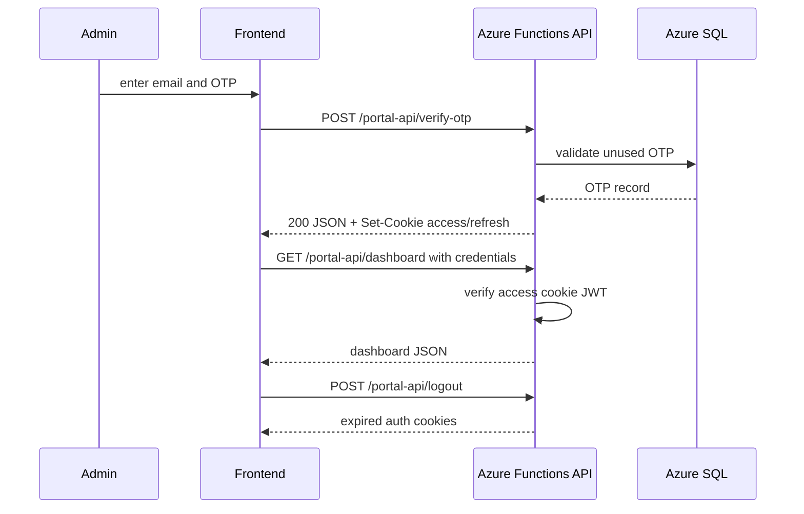

## Context

The current application is a Vue 3 frontend with an Azure Functions v4 backend written in JavaScript, Azure SQL persistence, Vitest unit tests, and Terraform-managed Azure infrastructure. `openspec/config.yaml` now defines the target architecture as Azure Functions v4 with TypeScript, Vue 3 with Tailwind CSS, Azure SQL, Azure Managed Redis, JWT access and refresh tokens in httpOnly cookies, Vitest plus Playwright, and ESLint/Prettier with strict TypeScript.

This change is cross-cutting. It affects runtime code, package scripts, test setup, auth behavior, infrastructure, deployment configuration, and documentation. The highest-risk parts are the authentication storage change and introducing Redis without making cached data authoritative.

## Goals / Non-Goals

**Goals:**

- Establish strict TypeScript as the source language for backend code and shared frontend logic where practical.
- Add type-check, lint, format, unit test, and end-to-end test gates that can run locally and in CI.
- Introduce Redis as a performance cache while keeping Azure SQL as the source of truth.
- Move admin JWT session material out of browser JavaScript and into secure httpOnly cookies.
- Keep existing RESTful JSON API shapes stable except where auth token transport changes.
- Keep rollback paths available during migration.

**Non-Goals:**

- Replacing Azure SQL as the durable store.
- Rewriting the frontend UI or gameplay model.
- Changing player identity requirements beyond what is needed for session/auth transport.
- Replacing Azure Functions with another hosting model.
- Implementing Redis-based queues, pub/sub, or distributed locks unless a later change requires them.

## Decisions

### Use incremental TypeScript migration

Backend Functions and shared frontend libraries will move to TypeScript with `strict` enabled. JavaScript files can be migrated by area, but the finished change must expose build/type-check scripts and source maps suitable for local debugging. Vue single-file components can remain Vue SFCs while their scripts and imported helpers use TypeScript where the repo benefits from type safety.

Alternative considered: convert the entire repository in one mechanical rename. That increases review risk and makes auth/cache behavior harder to validate. Incremental migration keeps behavioral changes testable.

### Keep Azure SQL authoritative and Redis disposable

Redis will cache safe, derived, or frequently requested data such as active campaign config, organization domain maps, and leaderboard responses. Writes continue to commit to Azure SQL first. Cache entries use explicit TTLs and are invalidated after mutations that affect the cached data. If Redis is unavailable, handlers log the cache failure and read from SQL.

Alternative considered: cache player session state as a primary fast path. That would complicate cross-device recovery and rollback. SQL remains the source of truth.

### Use httpOnly cookies for admin access and refresh tokens

`POST /api/portal-api/verify-otp` will mark the OTP used and set short-lived access and longer-lived refresh cookies with `HttpOnly`, `Secure`, and `SameSite` attributes appropriate for the deployed frontend/API relationship. Admin API requests authenticate from cookies. Refresh and logout endpoints rotate or clear cookies. The frontend stores only non-sensitive session state, such as whether the admin appears authenticated.

To support staged rollout, the existing `x-admin-key` path remains as break-glass. Bearer token support can remain temporarily behind configuration during migration, but the target contract is cookie-based.

Alternative considered: keep bearer JWTs but shorten lifetime. That still exposes token material to browser JavaScript and does not meet the target architecture.

### Treat security attributes as environment-aware configuration

Production cookies must be `Secure` and httpOnly. Local development may use non-secure cookies only when running on localhost. CORS and Static Web Apps/Functions settings must allow credentialed requests only for configured origins. JWT secrets and Redis credentials come from Key Vault or app settings, not committed files.

Alternative considered: hardcode local-friendly cookie settings. That risks weakening production defaults.

### Add Playwright for critical journeys, keep Vitest close to code

Vitest remains the unit-test tool and `*.test.js`/`*.test.ts` files stay co-located with implementation. Playwright covers smoke-level browser journeys: player onboarding/gameplay, admin OTP login with mocked delivery, admin dashboard access, and logout/session expiry. Test scripts must be explicit so task completion can run targeted Vitest suites and Playwright where behavior crosses frontend/API boundaries.

Alternative considered: rely only on Vitest. That leaves cookie/CORS/browser behavior under-tested.

### Keep Terraform as the Azure infrastructure source

Terraform will add Redis, app settings, Key Vault references where applicable, and outputs/documentation needed by deployment operators. Redis access key auth is acceptable because `config.yaml` names access key auth as the production target, but the key must be stored in Key Vault or app settings and never committed.

Alternative considered: hand-create Redis outside Terraform. That breaks repeatability and rollback.

## Risks / Trade-offs

- Auth cookie behavior differs between localhost, Static Web Apps, and production custom domains -> Mitigate with environment-specific config, Playwright coverage, and deployment verification notes.
- Redis outage could degrade endpoints or hide stale data -> Mitigate by making Redis best-effort, setting TTLs, invalidating after mutations, and logging cache failures without failing correctness-critical reads.
- TypeScript migration may create a large diff -> Mitigate by migrating module groups with tests and avoiding unrelated refactors.
- Lockfile drift blocks clean `npm ci` verification -> Mitigate by refreshing backend and frontend lockfiles as an early tooling task.
- Credentialed CORS can be misconfigured -> Mitigate by allow-listing configured origins only and testing credentialed admin calls end to end.
- Infrastructure cost increases with Redis and Playwright CI time -> Mitigate by documenting SKU choices, local alternatives, and smoke-focused e2e coverage.

## Migration Plan

1. Fix package lockfiles and add scripts for `typecheck`, `lint`, `format:check`, `test`, and Playwright smoke tests.
2. Introduce TypeScript configuration and migrate low-risk shared helpers first, then Functions handlers by endpoint group.
3. Add Redis client abstraction with no-op fallback, local development configuration, and cache tests before wiring endpoints.
4. Add Redis infrastructure and secure runtime settings through Terraform and deployment docs.
5. Implement cookie-based admin auth alongside existing bearer/static-key paths, then update frontend admin API calls to send credentials.
6. Add refresh/logout endpoints and Playwright coverage for login, authenticated admin request, refresh/session expiry, and logout.
7. Remove or disable browser `sessionStorage` token usage once cookie auth is verified.
8. Run backend/frontend Vitest suites, type-check, lint/format checks, and Playwright smoke tests before marking tasks complete.

Rollback strategy: keep the previous bearer-token path and no-cache behavior available until cookie auth and Redis are validated. If Redis causes runtime issues, unset Redis configuration and fall back to SQL reads. If cookie auth fails in production, re-enable bearer mode temporarily and redeploy the previous frontend admin client while investigating. TypeScript migration rollback should revert by module group rather than mixing generated JavaScript into source.

## Open Questions

- Should Playwright tests run against Docker Compose by default, or should they target separately started backend/frontend dev servers?
- What Redis SKU should production use for the first release, and should lower environments use a smaller SKU or local container only?
- Should bearer JWT support be removed in the same change after migration, or retained for one release as a compatibility bridge?
- Which CI provider will enforce the new gates for public contributors?
