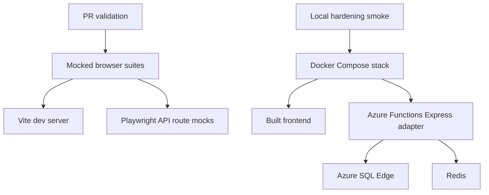
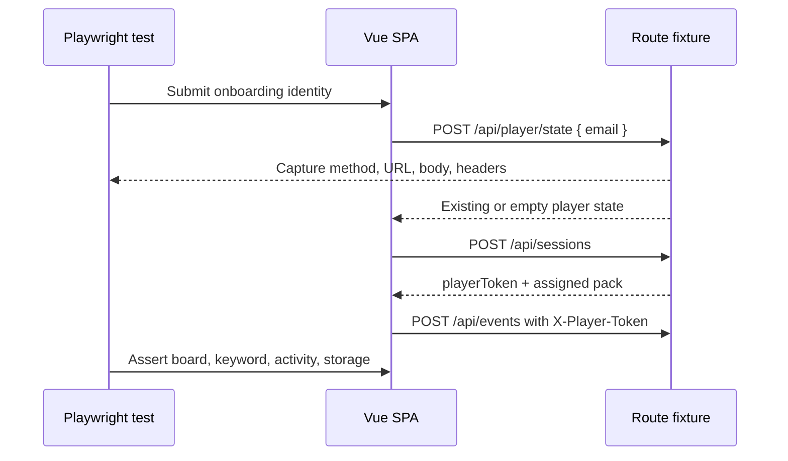
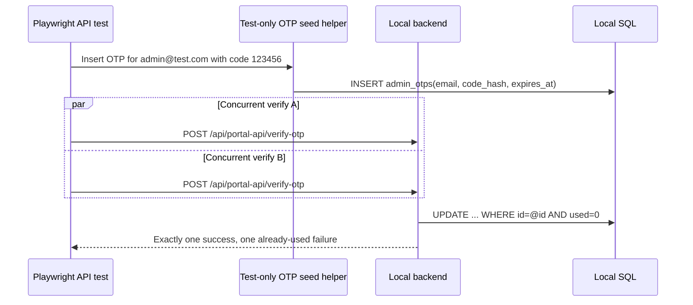

## Context

The frontend already has a Playwright setup in [frontend/playwright.config.ts](frontend/playwright.config.ts) and three browser tests under [frontend/e2e/](frontend/e2e/): one player happy path, one admin login/logout happy path, and one mobile grid layout check. Those tests mock API responses through [frontend/e2e/fixtures.ts](frontend/e2e/fixtures.ts), which keeps the suite fast and deterministic, but the current coverage does not exercise most admin portal screens or the hardening-sensitive boundaries introduced by `harden-admin-session-and-otp`.

The hardening work changes or tightens contracts around `POST /api/player/state`, admin refresh/logout Origin enforcement, and atomic OTP consumption. Some of those can be checked in the browser with route capture; others require the real backend, SQL state, and cookies. The design therefore separates fast mocked functional coverage from optional full-stack smoke coverage instead of making every PR run depend on Docker Compose.

## Goals / Non-Goals

**Goals:**
- Expand Playwright coverage for the full player experience, admin portal workflows, and mobile-critical UI behavior.
- Add hardening regression tests that fail when email leaks into player-state URLs, admin tokens are exposed to browser storage, refresh/logout skip Origin checks, or OTP replay creates duplicate sessions.
- Keep the default Playwright suite fast, isolated, deterministic, and suitable for CI.
- Provide an opt-in full-stack smoke path against the local Docker Compose stack for tests that need Azure SQL Edge, Redis, backend cookies, and real API handlers.
- Reuse existing Playwright and project tooling wherever possible.

**Non-Goals:**
- No runtime application behavior changes beyond test-only helper code.
- No production-only secret, Azure resource, Terraform, or database schema changes.
- No reliance on live Azure dev resources for destructive or data-creating tests.
- No attempt to replace Vitest unit coverage for pure validation or handler edge cases.

## Decisions

### D1 — Use layered Playwright suites

Default `npm run e2e --prefix frontend` remains a fast browser suite against Vite with mocked API routes. The expanded suite should cover player and admin UI workflows by routing `**/api/**` inside Playwright and asserting both DOM outcomes and captured request metadata.

Full-stack tests should be explicitly gated, run serially, and target `E2E_BASE_URL=http://localhost:8080` (or another caller-supplied local URL) only after `docker compose up --build` is running. These tests validate real backend behavior that route mocks cannot prove.

**Alternatives considered**: (a) Run every test full-stack. Rejected because SQL/Redis startup makes normal UI regression checks slow and brittle. (b) Keep only mocked browser tests. Rejected because Origin allowlist and OTP double-spend protections must be verified against real handlers and cookies.

### D2 — Keep functional tests user-centered but assert contracts at boundaries

Mocked browser tests should interact through accessible locators where practical and avoid implementation selectors except for stable game-specific elements already used by existing tests, such as `.tile` for board count/layout. The tests should still capture network requests and browser storage for hardening contracts that are invisible in the UI.

**Alternatives considered**: (a) Assert only the final UI. Rejected because privacy and token contracts are request-level properties. (b) Assert internal Vue state directly. Rejected because browser-level behavior is the point of this coverage.

### D3 — Add reusable fixtures instead of one-off route handlers

The existing `mockApi(page)` fixture should be extended or split into smaller helpers for player state, admin portal data, request capture, dialog handling, and authenticated admin setup. Route mocks should support overrides so individual specs can simulate API failures, 401 token refresh, duplicate admin actions, empty states, and destructive confirmation results without copy-pasting a full API switch statement.

**Alternatives considered**: Keep all mock behavior in one large switch. Rejected because admin CRUD and hardening cases will make that fixture difficult to reason about.

### D4 — Seed full-stack OTP state through a test-only helper

Full-stack OTP replay/race tests need a known valid OTP. Because the production API intentionally never returns the code, the full-stack path should use a test-only backend script/helper that connects to the local SQL database, hashes a caller-provided code with the existing backend OTP hashing logic, and inserts an `admin_otps` row for a unique test admin email. The helper must be documented as local-only and should not add any production endpoint.

**Alternatives considered**: (a) Parse OTPs from backend logs. Rejected as brittle and Docker-specific. (b) Add a test-only HTTP endpoint. Rejected because it changes the runtime surface. (c) Skip full-stack OTP replay because Vitest covers it. Rejected because the user-requested functional plan should catch integration regressions after hardening.

### D5 — Gate destructive and slow checks explicitly

Full-stack tests that create players, campaigns, submissions, or admin OTP rows must use unique IDs/emails and MUST NOT run against shared Azure environments. The suite should require an explicit environment variable such as `FULLSTACK_E2E=1` and should skip with a clear message otherwise.

**Alternatives considered**: Auto-detect full-stack availability and run when a URL responds. Rejected because a developer could accidentally point at a shared environment.

## Risks / Trade-offs

- **[Risk] Mocked browser tests drift from backend behavior** → Mitigation: keep request/response shapes aligned with specs and add the full-stack smoke path for security-sensitive handlers.
- **[Risk] Full-stack tests become slow or flaky** → Mitigation: keep them opt-in, serial, uniquely named, and focused on a small number of high-value smoke paths.
- **[Risk] OTP seed helper could be mistaken for production behavior** → Mitigation: implement it as a script/test helper only, document it as local-only, and avoid exposing any HTTP route.
- **[Risk] UI text changes create brittle tests** → Mitigation: prefer roles, labels, and stable visible workflow anchors; use exact text only for user-facing contract messages.
- **[Risk] Hardening work may still be in-flight while these tests are added** → Mitigation: write the new tests against the target OpenSpec contracts and let failures identify any remaining implementation gap.

## Migration Plan

1. Add or refactor Playwright fixtures for reusable API mocks, request capture, admin session setup, unique data, and dialog handling.
2. Add fast mocked browser specs for player functionality, admin portal functionality, hardening browser contracts, and responsive behavior.
3. Add gated full-stack specs and any local-only OTP seed helper needed for real backend OTP replay/Origin checks.
4. Add package scripts and documentation for fast and full-stack execution.
5. Run the fast Playwright suite locally; run the full-stack suite against Docker Compose before enabling it in broader validation.
6. Rollback by removing the added specs, fixtures, scripts, docs, and test-only helper. No app runtime rollback or database migration is required.

## Open Questions

- Should CI run only the fast mocked suite initially, or should a nightly/manual job also run the full-stack smoke suite?
- Should the full-stack smoke suite live entirely under `frontend/e2e/`, or should backend-owned helpers live under `backend/scripts/` with frontend tests invoking them?