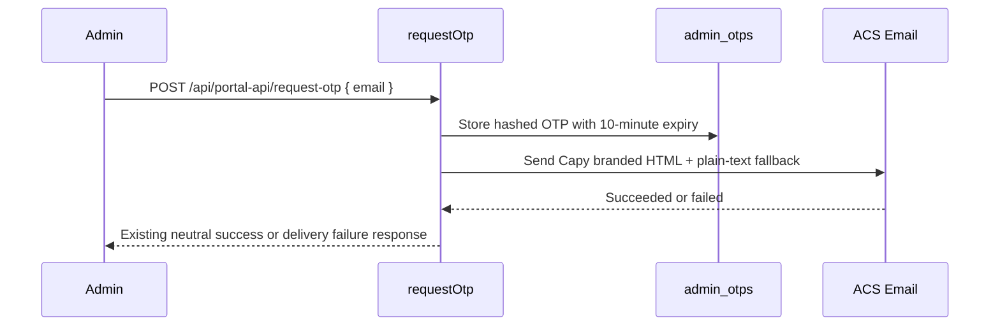

## Context

Admin OTP messages are sent from `backend/src/lib/email.ts` through Azure Communication Services Email. The current admin helper sends only a plain-text body with older Copilot Bingo wording, while the product-facing experience has moved toward Capy branding. The request and verification flow already handles the important security constraints: 6-digit random codes, hashed storage, 10-minute expiry, rate limiting, anti-enumeration responses, failed-send invalidation, and non-sensitive telemetry.

The desired change is presentational: make the delivered admin OTP email look like the attached Capy verification-code card without changing the API behavior or persistence model.

## Goals / Non-Goals

**Goals:**

- Send admin OTP emails with a branded Capy HTML card that highlights the 6-digit verification code.
- Keep a concise plain-text fallback with the same essential information.
- Preserve all existing admin OTP security, telemetry, rate limiting, failure, and response behavior.
- Keep implementation small and testable in the existing ACS Email helper tests.

**Non-Goals:**

- Do not change admin OTP generation, hashing, database schema, expiry, verification, or session issuance.
- Do not change player recovery email copy or presentation in this change.
- Do not add a live "request a new one" link until the app has an explicit public frontend URL contract for email links.
- Do not include request IP address in the first version because the current email helper does not receive a trusted client IP and adding one would expand privacy and proxy-handling requirements.
- Do not add a third-party email templating dependency.

## Decisions

### D1 - Add HTML content to the existing ACS payload

Use the ACS Email `content.html` field for the branded template and keep `content.plainText` for fallback clients. This keeps the delivery provider and helper contract unchanged.

Alternatives considered:

- Replace plain text with HTML only. Rejected because plain-text fallback is important for accessibility, deliverability, and clients that block HTML.
- Move rendering into a separate templating package. Rejected because this template is small, static, and can be safely rendered with simple TypeScript functions.

### D2 - Use inline, email-client-friendly markup

Render a centered email shell with inline CSS, a white card, a `Welcome to Capy` heading, a large spaced verification code block, expiry copy, ignore-this-email safety copy, and a simple `The Capy Team` signature. Keep the structure conservative so it renders across Outlook, mobile clients, and webmail.

Alternatives considered:

- Use external stylesheets or modern layout CSS. Rejected because many email clients strip external styles and have uneven CSS support.
- Match the screenshot exactly, including sender metadata visible in Outlook. Rejected because the visible header metadata is mail-client UI, not message body content controlled by the app.

### D3 - Keep dynamic data minimal

The renderer should accept the code and fixed copy only. It should not interpolate raw email addresses, request IPs, URLs, provider configuration, or secrets into the HTML body.

Alternatives considered:

- Include request IP like the screenshot. Deferred because trusted client IP extraction from Azure Functions and proxies needs a separate privacy/security decision.
- Include a retry link. Deferred because email links need a dedicated public app URL setting rather than borrowing `ALLOWED_ORIGINS`.

### D4 - Scope this change to admin OTP

Only `sendAdminOtpEmail` changes in behavior. Player recovery can reuse the same visual system later, but that should be an explicit product decision because player recovery has different copy and support expectations.

Alternatives considered:

- Update player recovery emails at the same time. Rejected for this change to avoid expanding the scope beyond the attached admin OTP example.

## Risks / Trade-offs

- [Risk] HTML email renders differently across clients -> Mitigation: use simple table/block-compatible markup, inline styles, stable widths, and keep plain-text fallback.
- [Risk] A visual-only change accidentally changes auth behavior -> Mitigation: keep the request handler unchanged and add unit assertions only around the ACS message payload content.
- [Risk] Code spacing in HTML makes copy/paste awkward -> Mitigation: display spaced digits visually while keeping the plain-text fallback and underlying text clear.
- [Risk] Future teams expect the retry link/IP from the screenshot -> Mitigation: document them as explicit non-goals until public URL and trusted IP requirements are defined.

## Migration Plan

1. Add a small admin OTP email rendering helper inside the backend email module or an adjacent helper.
2. Update `sendAdminOtpEmail` to pass both `plainText` and `html` content to ACS Email.
3. Add Vitest coverage for subject, plain-text fallback, branded HTML body, expiry copy, and recipient preservation.
4. Run the backend email helper tests and typecheck.
5. Deploy normally; no database, infrastructure, or environment-variable migration is required.

Rollback: revert the helper payload to the previous plain-text-only content. Previously issued OTP rows and verification behavior remain compatible.

## Open Questions

- Should a future change introduce a public frontend URL setting for safe email links such as "request a new code"?
- Should a future change add trusted request IP display after documenting proxy/header trust and privacy requirements?
- Should player recovery adopt the same Capy email shell in a separate change?
