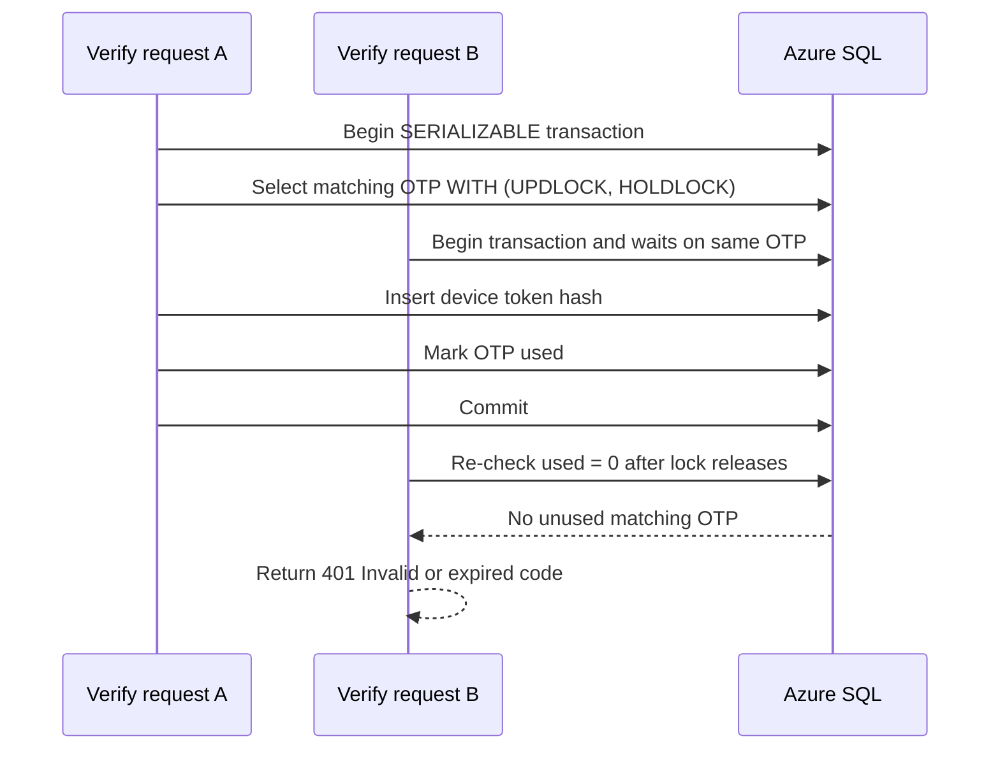

## Context

Player recovery verification currently starts a `SERIALIZABLE` SQL transaction and then selects the matching recovery-code row with `UPDLOCK`, `HOLDLOCK`, and `READPAST`. Azure SQL rejects this query with error 650 because `READPAST` is only valid under `READ COMMITTED` or `REPEATABLE READ`. The deployed symptom is a successful `player_recovery_request` email send followed by `player_recovery_verify` with `failure_class: "service_error"` and the frontend message "Could not verify recovery code. Please try again."

The existing recovery contract is still the right shape: a valid code must atomically create a new device token and mark the code used, invalid codes must return 401, and unexpected failures must return a retryable service failure without consuming the code.

## Goals / Non-Goals

**Goals:**

- Make player recovery verification compatible with Azure SQL lock-hint and transaction rules.
- Preserve atomic valid-code redemption: device-token creation and marking the recovery code used commit together or roll back together.
- Preserve double-redemption protection and avoid issuing more than one token for a single recovery code.
- Preserve existing endpoint paths, request/response shapes, cookies, telemetry sensitivity boundaries, and frontend error classes.
- Add regression coverage so the invalid `SERIALIZABLE` plus `READPAST` combination is not reintroduced.

**Non-Goals:**

- Changing recovery-code TTL, code length, request cooldown, or ACS email delivery behavior.
- Replacing recovery codes with magic links or identity-provider login.
- Adding database tables, columns, or new API endpoints.
- Changing admin OTP behavior or admin authentication cookies.

## Decisions

### D1 - Keep `SERIALIZABLE`; remove `READPAST` from recovery-code lookup

The verification transaction should continue using `SERIALIZABLE` and should keep row-level update locking on the candidate OTP row, but the candidate lookup must not use `READPAST`. Under contention, a second verifier for the same code should wait for the first transaction to finish, then re-evaluate the `used = 0` predicate. If the first transaction commits, the second request returns 401. If the first transaction rolls back, the code remains usable until expiry.

Rationale: this keeps the strongest existing transaction semantics while removing only the incompatible hint. It also avoids the user-hostile behavior where `READPAST` could skip a locked but ultimately rolled-back valid code and return an invalid-code result too early.

Alternatives considered:

- Change the transaction to `READ COMMITTED` or `REPEATABLE READ` so `READPAST` is allowed. Rejected because skipping locked rows is not desirable for recovery verification; waiting preserves the accurate outcome after commit or rollback.
- Remove both `READPAST` and transaction isolation. Rejected because the recovery flow still needs clear double-redemption safety.
- Handle SQL error 650 as a retryable special case. Rejected because the query would still be invalid and every valid-code attempt would continue failing until code changes are deployed.

### D2 - Treat invalid code and service failure behavior as unchanged contracts

No frontend contract change is needed. The backend should continue returning HTTP 401 only when no unused, unexpired matching code exists after locks settle. Unexpected database or token-persistence failures should continue rolling back and returning the retryable service failure response. Existing frontend logic can keep mapping 401 to the invalid/expired message and 5xx/status 0 to the service-failure message.

Rationale: the bug is below the API contract. Keeping the contract steady reduces blast radius and keeps previous UI hardening useful.

Alternatives considered: add a new response code for SQL lock conflicts. Rejected because normal lock waiting should not be exposed to the browser, and the existing 401/5xx split is already user-actionable.

### D3 - Add a SQL-locking regression check plus deployed smoke validation

Unit tests that mock `mssql` cannot reproduce Azure SQL error 650, but they can assert the query issued under `SERIALIZABLE` no longer contains `READPAST`. The fix should also be verified with a deployed smoke path: request a fresh recovery code for a claimed test player, verify the code, and confirm `player_recovery_verify` logs `outcome: "verify_success"` instead of `failure_class: "service_error"`.

Rationale: a narrow unit assertion catches accidental reintroduction of the exact invalid combination, while a live smoke check proves the provider/database path actually works.

Alternatives considered: rely only on manual browser verification. Rejected because the same visual error could come from network, API, or SQL failures. Rely only on unit tests. Rejected because mocked SQL does not validate lock-hint compatibility.

## Risks / Trade-offs

- [Risk] Removing `READPAST` can make concurrent redemption attempts wait briefly instead of returning immediately. -> Mitigation: the transaction is short, scoped to one OTP lookup and token insert, and waiting gives the correct post-commit outcome.
- [Risk] Unit tests may still miss other SQL Server-specific lock-hint issues. -> Mitigation: include deployed smoke verification and query Application Insights for recovery verification telemetry after deployment.
- [Risk] A second request could see higher latency during a parallel redemption. -> Mitigation: only same-code contention should block, and the user still receives a correct invalid/expired response after the successful redemption commits.

## Migration Plan

1. Update the recovery verification query to remove `READPAST` while keeping atomic transaction behavior.
2. Add or update backend tests to assert successful redemption, double redemption, rollback-on-token-failure behavior, and absence of `READPAST` in the serializable lookup path.
3. Run focused backend tests for `verifyPlayerRecovery` and player auth helpers.
4. Deploy the backend package.
5. Request and verify a fresh recovery code for a claimed test player in the deployed environment.
6. Check Application Insights for `player_recovery_request` with `outcome: "sent"` followed by `player_recovery_verify` with `outcome: "verify_success"` and no SQL error 650.

Rollback: redeploy the previous backend package. No schema rollback is required, and unused recovery-code rows will expire naturally.

## Open Questions

- Should we add a lightweight optional script for the live recovery smoke check, or keep it as an operator-run browser/API procedure for this narrow fix?