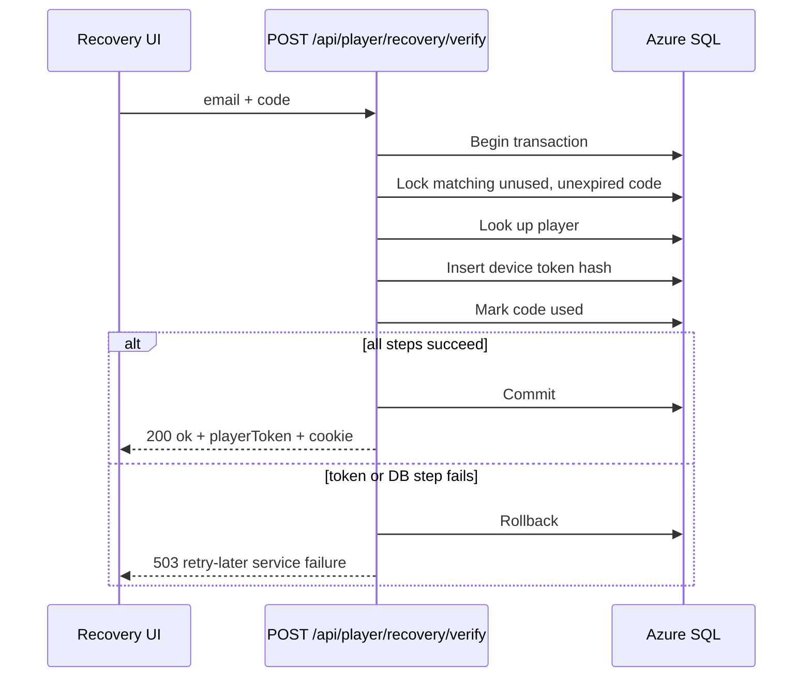

## Context

Player recovery is intentionally separate from admin OTP. Admin OTP validates allow-listed admins and issues admin cookies, while player recovery proves access to a player email and issues a player token. Both flows use Azure Communication Services Email and short-lived 6-digit codes, but their runtime behavior has drifted:

- Admin OTP uses branded HTML plus plain text email content.
- Player recovery uses a one-line plain text message.
- Player recovery verification currently consumes a matching recovery code before creating the replacement device token.
- The frontend recovery panel falls back to "Invalid or expired code" when verification returns an unexpected failure, including HTTP 500 responses.

The observed user symptom is that recovery codes appear to expire immediately. The configured TTL is already 10 minutes, so the design focuses on misleading failure handling and code-consumption safety rather than shortening or extending the TTL.

## Goals / Non-Goals

**Goals:**

- Send player recovery emails with the same branded HTML and plain-text quality as admin OTP emails.
- Preserve the existing player recovery code length, TTL, cooldown, endpoint paths, anti-enumeration behavior, and non-sensitive telemetry.
- Keep admin OTP and player recovery security boundaries separate.
- Prevent recoverable backend failures from burning a valid player recovery code.
- Make frontend recovery errors distinguish invalid/expired codes from service failures.
- Add tests that lock in email content and verification failure behavior.

**Non-Goals:**

- Replacing numeric OTPs with magic links or identity-provider login.
- Changing admin OTP behavior beyond extracting reusable email-rendering structure if helpful.
- Changing player recovery endpoint paths or adding a new database table.
- Solving players who have lost access to their email inbox.
- Exposing recovery codes, player tokens, raw emails, provider secrets, or OTP hashes in logs or responses.

## Decisions

### D1 - Share the branded OTP email structure across admin and player recovery

Extract or reuse the admin OTP email rendering structure so player recovery sends both `content.html` and `content.plainText`. The player recovery copy should remain player-specific, for example "Your player recovery code is:" while retaining the same visual treatment, spaced 6-digit code, 10-minute expiry copy, ignore-this-email copy, and signature style.

Rationale: a single renderer reduces future drift while keeping flow-specific subjects and wording explicit. The ACS payload shape should match the admin quality bar without changing the recovery request API.

Alternatives considered: keep player recovery plaintext-only. Rejected because it preserves the inconsistency the user reported and is less resilient across mail clients. Reuse the exact admin subject and body verbatim. Rejected because player recovery is not admin verification and should remain clear to the recipient.

### D2 - Preserve player/admin separation

The shared email rendering code must not share authorization behavior. `sendAdminOtpEmail` and `sendPlayerRecoveryEmail` can delegate to common rendering/sending helpers, but admin request/verify endpoints and player recovery endpoints must continue to use separate tables, cookies, tokens, telemetry flow labels, and response semantics.

Rationale: the existing threat model depends on admin authorization and player ownership proof being different ceremonies.

Alternatives considered: route player recovery through admin OTP. Rejected because admin OTP applies an allow-list and issues admin auth state, which would make mixed admin/player identities harder to reason about.

### D3 - Make recovery verification atomic around token issuance

Player recovery verification should perform code consumption and device-token creation in a single database transaction. A valid, unused, unexpired code should only become used if the replacement player token hash is also persisted and the transaction commits. If token creation, player lookup, or a database operation fails after the candidate code is found, the transaction should roll back so the player can retry the same code while it remains within its TTL.

Rationale: the current order can turn a transient 500 into an apparent immediate expiry because the code may already be marked used. Transactional verification keeps single-use semantics for successful redemption while avoiding accidental loss on service failure.

Alternatives considered: create the token before consuming the code without a transaction. Rejected because a failure between operations can still leave partial state. Return a new code automatically on failure. Rejected because it would send surprise email and complicate anti-enumeration behavior.

### D4 - Keep invalid-code responses distinct from service failures

The backend should continue returning HTTP 401 with `{ ok: false, message: "Invalid or expired code" }` only when no valid unused code matches, the code is expired, or another request has already consumed it. Unexpected server-side failures during verification should return a 5xx JSON response with a retry-later message and should not increment invalid-code lockout counters unless the submitted code was actually invalid.

The frontend should show the invalid/expired message only for 401 recovery verification responses. For HTTP 5xx, status 0, or missing response data, it should show a service-failure message such as "We could not verify the recovery code right now. Please try again."

Rationale: users need to know whether to re-check the code or retry later. Support also needs fewer reports where infrastructure errors masquerade as user mistakes.

Alternatives considered: keep one generic error for all failures. Rejected because it directly caused the confusing expiry symptom.

### D5 - Preserve observability and sensitive-data boundaries

Existing recovery telemetry should continue using hashed email identifiers and outcome labels. New or adjusted failure paths must not log recovery codes, player tokens, token hashes, raw emails, ACS connection strings, or email body content.

Rationale: the recovery flow handles credentials and personal data. Better diagnostics should not widen the data exposure surface.

Alternatives considered: log more verification detail for debugging. Rejected because code/token exposure would be worse than the operational ambiguity.

## Risks / Trade-offs

- [Risk] Transactional verification can add a small amount of database locking around a hot recovery code row. -> Mitigation: the transaction is short and scoped to one email/code candidate.
- [Risk] Refactoring the email renderer could accidentally change admin OTP content. -> Mitigation: keep admin OTP tests and add player recovery tests that assert both flow-specific copy and shared security exclusions.
- [Risk] Rolling back on token creation failure means a player can retry the same code after a transient server error. -> Mitigation: the code remains short-lived, rate-limited at issuance, and still single-use once a token is successfully issued.
- [Risk] Different frontend messages can expose too much detail. -> Mitigation: distinguish only user-actionable classes: invalid/expired versus service unavailable, without revealing whether the email exists.

## Migration Plan

1. Add or refactor email rendering so player recovery sends branded HTML plus plain text while preserving admin OTP behavior.
2. Update recovery verification to use transaction semantics for candidate code consumption and device-token creation.
3. Update frontend recovery error handling so 401 shows invalid/expired and 5xx/status-0/malformed responses show retry-later copy.
4. Add/update Vitest coverage for email payloads, verification rollback behavior, and frontend error selection.
5. Run backend and frontend test suites relevant to recovery.
6. Deploy backend before frontend if split deployment is needed; the frontend remains compatible with the existing endpoint shape.

Rollback: revert the backend recovery/email changes and frontend error handling. No schema rollback is expected because this design does not add tables or columns.

## Open Questions

- Should the player recovery subject stay "Your Copilot Bingo player recovery code" or move closer to the admin subject while retaining player-specific body copy?
- Should the frontend keep the entered code after a service failure to make retry easier, or clear it only after invalid/expired responses?
