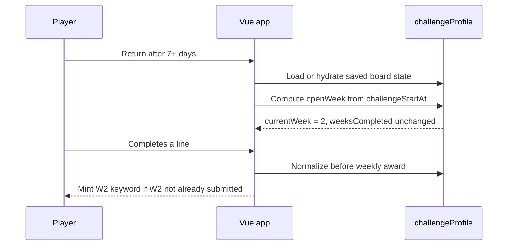

## Context

Weekly challenge state is stored in the frontend `challengeProfile` object and persisted inside local storage and `boardState`. Today `currentWeek` is advanced only when `tryWeeklyClear()` mints a weekly keyword after a line win. That makes the displayed week depend on prior weekly award activity instead of elapsed time, so players who return after the next weekly boundary can still see Week 1.

The intended behavior is time-driven: the open week is derived from `challengeStartAt`, using the existing `MS_PER_WEEK` interval and capped by `TOTAL_WEEKS`. `weeksCompleted` and `weeklySubmissions` remain completion/award tracking, not availability tracking.

## Goals / Non-Goals

**Goals:**

- Open Week 2 automatically after seven days from board start, even when Week 1 was not completed.
- Keep the displayed current week, weekly award generation, and persisted challenge profile aligned with elapsed board time.
- Preserve the existing challenge profile storage shape so old saved boards continue to load.
- Add focused unit coverage for stale profiles, hydration, and awarding the current timed week.

**Non-Goals:**

- No backend API, Azure SQL schema, or campaign configuration changes.
- No change to line keyword generation, tile verification, leaderboard submission format, or assignment rotation criteria.
- No automatic backfill of missed weekly awards; a player earns a weekly keyword only when they complete a qualifying line during an open week.

## Decisions

1. Use `challengeStartAt` as the source of truth for week availability.

   The frontend should compute `openWeek = clamp(floor((Date.now() - challengeStartAt) / MS_PER_WEEK) + 1, 1, TOTAL_WEEKS)`. This keeps availability deterministic across reloads and devices as long as the board state is restored. An alternative was to store a server-computed week, but that would add API and time-source coupling without solving a persistence-shape problem.

2. Normalize challenge profiles at state boundaries and before award checks.

   The game should normalize `currentWeek` after local load, after server hydration, after creating/resetting a challenge profile, and before `tryWeeklyClear()` decides whether the current week has already been submitted. This prevents stale persisted values from trapping users and ensures the award path sees the same week that the UI shows. An alternative was to make `ChallengeBar` compute the week independently, but then UI and award logic could diverge.

3. Keep `weeksCompleted` tied to awarded weekly clears.

   `weeksCompleted` should continue to count unique weekly submissions because assignment completion currently depends on completed weekly awards, not merely elapsed time. The open week can advance to Week 2 while `weeksCompleted` remains 0. This avoids unintentionally completing or rotating an assignment because time passed.

4. Award only the currently open timed week.

   If Week 2 is open and Week 1 was never completed, the next weekly clear should mint the Week 2 keyword and record Week 2 in `weeklySubmissions`. The system should not auto-award Week 1 or require Week 1 before Week 2. This matches the clarified product behavior and keeps missed weeks missed rather than silently generated.

## Risks / Trade-offs

- Existing saved profiles may have stale `currentWeek` values → Normalize on load and hydration while preserving the stored `challengeStartAt`.
- Users can skip weekly awards by not completing lines during earlier weeks → This is intentional for time-driven availability; missed weeks are not backfilled.
- Client clock manipulation can affect open-week calculation → This already applies to the current client-side weekly logic and is out of scope for this focused fix.
- `weeksCompleted` can be less than `currentWeek - 1` → UI and tests should treat completion and availability as separate concepts.

## Migration Plan

1. Add a small normalization helper in the game composable.
2. Call it when challenge profiles are created, loaded, hydrated, and before weekly award checks.
3. Update unit tests to cover automatic Week 2 opening after seven days without Week 1 completion, stale hydration catch-up, and Week 2 award after skipping Week 1.
4. Deploy as a frontend-only update.

Rollback: revert the frontend helper and call sites to restore the previous event-driven `currentWeek` advancement behavior. Stored board state remains compatible because no data shape changes are introduced.

## Open Questions

- Should the UI eventually communicate that missed weeks remain incomplete while later weeks are open? This is outside the current fix but may reduce player confusion.
