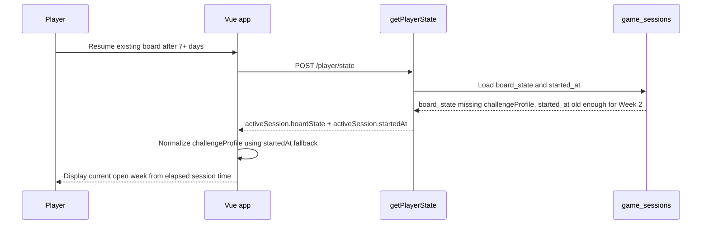

## Context

Weekly challenge availability is time-driven from `challengeProfile.challengeStartAt`. The prior time-driven progression change normalized stale `currentWeek` values when a saved or server-hydrated challenge profile already had a valid start timestamp.

Some older or partially restored `game_sessions.board_state` payloads can be missing `challengeProfile`, or can include a profile with a missing or invalid `challengeStartAt`. In those cases the frontend currently has no durable board-start anchor, even though `POST /api/player/state` already returns `activeSession.startedAt` from `game_sessions.started_at`.

The affected users are existing players resuming a board after the weekly boundary. Player experience and support teams need the app to recover the open week without manually patching every row or changing assignment completion semantics.

## Goals / Non-Goals

**Goals:**

- Recover a missing or invalid challenge start timestamp during server hydration using `activeSession.startedAt`.
- Ensure old `board_state` rows with no `challengeProfile` can still display the correct time-open week after resume.
- Preserve weekly completion semantics: missed weeks remain missed, and weekly keywords are awarded only when a qualifying line is completed.
- Add focused unit coverage for absent profile, invalid start timestamp, and stale local profile fallback cases.
- Avoid package-manager install commands and dev-server execution during verification unless the TanStack advisory risk is rechecked first.

**Non-Goals:**

- No Azure SQL schema migration or API route change.
- No dependency, lockfile, router, or build-tool upgrade.
- No automatic data backfill of weekly submissions, weekly keywords, or completed assignment status.
- No user-facing copy changes for missed weeks.

## Decisions

1. Use `activeSession.startedAt` as a hydration-only fallback.

   During `hydrateFromServer`, the frontend should parse the returned session start timestamp and pass it into challenge-profile normalization. If the server board state lacks a usable `challengeProfile.challengeStartAt`, the normalized profile should use that session start as the source of truth for elapsed-week calculation.

   Alternative considered: patch Azure SQL JSON values directly. A data repair can unblock known bad rows, but it does not prevent future malformed or missing payloads from regressing. The code fallback is the durable fix.

2. Keep fallback logic in the existing challenge-profile normalization path.

   Extending the normalization helper keeps UI display, weekly-award logic, and persisted profile shape aligned. Hydration can construct a minimal profile when needed, then rely on the same `getOpenChallengeWeek` calculation already used for valid profiles.

   Alternative considered: compute the display week inside `ChallengeBar`. That would risk UI and award paths diverging, especially when the player earns a weekly keyword after resume.

3. Prefer a valid server session start over a newly-created local profile when hydrating server state.

   A resume flow can create a fresh local `challengeProfile` with `Date.now()` before server hydration returns. If the server board state has no profile, keeping the fresh local timestamp would trap an older board in Week 1. Hydration should prefer the older valid `activeSession.startedAt` when the server payload cannot provide a profile start.

   Alternative considered: only use the fallback when `state.challengeProfile` is null. That misses the fresh-local-profile race and leaves the existing-user symptom unresolved for some paths.

4. Do not change completion or rotation rules.

   `weeksCompleted` and `weeklySubmissions` remain award-tracking fields. The fallback affects current open-week availability only, so assignment rotation continues to depend on earned weekly clears rather than elapsed time alone.

## Risks / Trade-offs

- [Risk] Client clock still controls open-week computation. -> Mitigation: this matches the current frontend weekly progression model and does not expand the existing trust boundary.
- [Risk] `startedAt` may be missing or unparsable from unexpected API shapes. -> Mitigation: fall back to the existing `Date.now()` behavior when no valid timestamp exists.
- [Risk] A one-time database repair might still be needed for operational reporting or users on older deployed clients. -> Mitigation: keep the code fix first, then run a read-only affected-row count before deciding whether to patch data.
- [Risk] Verification commands could refresh dependencies during a supply-chain incident. -> Mitigation: avoid install/dev-server commands and rely on current lockfile-safe test commands only after the advisory check is repeated.

## Migration Plan

1. Update frontend server-session typing to include `startedAt`.
2. Add a small timestamp parser for numeric millisecond values and date strings returned by the backend.
3. Extend challenge-profile normalization to accept a fallback start timestamp and create/repair profiles during server hydration.
4. Add focused Vitest coverage for missing profile, invalid start timestamp, and fresh-local-profile override cases.
5. Verify without package-manager install or dev-server commands unless the TanStack advisory check is repeated.

Rollback: revert the frontend normalization fallback and tests. No database or API rollback is required.

## Open Questions

- Should operations run a read-only SQL report to estimate how many active sessions have missing or invalid `board_state.challengeProfile.challengeStartAt` before considering a one-time repair?